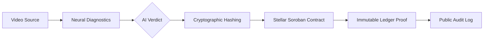

# 🛡️ AuthentiScan: Trust Infrastructure for the AI Age

AuthentiScan is an industrial-grade "Truth Anchor" platform that converges **Advanced AI Diagnostics** with **Stellar Blockchain Immutability** to verify and secure video authenticity.

In an era of ubiquitous deepfakes, AuthentiScan provides a cryptographic audit trail that allows media organizations, verification labs, and individuals to anchor digital proof of reality directly to a decentralized ledger.

---

## 💎 Core Pillars

- **AI Forensic Diagnostics:** Multi-modal analysis covering spatial anomalies, temporal stability, and spectral audio consistency.
- **Cryptographic Anchoring:** Every verification record generates a unique SHA-256 fingerprint anchored to the Stellar Testnet.
- **Immutable Audit Trail:** Once a record is "Broadcasting" to the ledger, it becomes a permanent, tamper-proof record of truth.
- **Transparency First:** Integrated explorer telemetry allows anyone to verify the provenance of a video independently.

---

## 🛠️ Technical Architecture



---

## 🚀 Quick Start for Developers

### 1. Project Prerequisites
| Tool | Requirement |
| :--- | :--- |
| **Node.js** | v18.0+ |
| **Rust** | Stable toolchain |
| **Stellar CLI** | Modern version |
| **Freighter Wallet** | Browser Extension |

### 2. Global Setup

```bash
# Clone the repository
git clone https://github.com/tunisch/block-chain-project
cd block_chain_project

# 1. Build the Smart Contract
cd contract
stellar contract build

# 2. Deploy to Testnet
stellar network add testnet \
  --rpc-url https://soroban-testnet.stellar.org:443 \
  --network-passphrase "Test SDF Network ; September 2015"

stellar keys generate deployer --network testnet --fund
stellar contract deploy --wasm target/wasm32-unknown-unknown/release/video_verification.wasm --source deployer --network testnet
```

### 3. Frontend Integration

1.  **Environment Setup:** Create `frontend/.env.local`
    ```env
    NEXT_PUBLIC_CONTRACT_ID=YOUR_DEPLOYED_CONTRACT_ID
    NEXT_PUBLIC_SOROBAN_RPC_URL=https://soroban-testnet.stellar.org
    ```
2.  **Install & Launch:**
    ```bash
    cd frontend
    npm install
    npm run dev
    ```

---

## 🔐 Security & Integrity

- **Deterministic Hashing:** AuthentiScan uses SHA-256 hashing in the browser (via `SubtleCrypto`) to ensure the original video content matches the on-chain record exactly.
- **Non-Custodial:** AuthentiScan never stores your video. Analysis happens locally; only cryptographic proofs are anchored.
- **Wallet Gating:** All ledger commits require explicit authorization via the **Freighter Wallet**. If the wallet is not detected, the system provides an automated onboarding redirection.

---

## 🧪 Forensic Accuracy Notice

> [!IMPORTANT]
> AI analysis is probabilistic and does not constitute definitive proof of authenticity. Final judgment should be supported by multi-modal forensic evidence and verified via the on-chain audit trail provided by this platform.

---

## 👨‍💻 Developed by
**Lead Researcher:** [Tunahan Türker Ertürk](https://www.linkedin.com/in/tunahanturkererturk/)
**Source Repository:** [GitHub](https://github.com/tunisch/block-chain-project)

---
© 2026 AuthentiScan Lab. Secure. Immutable. Verifiable.
