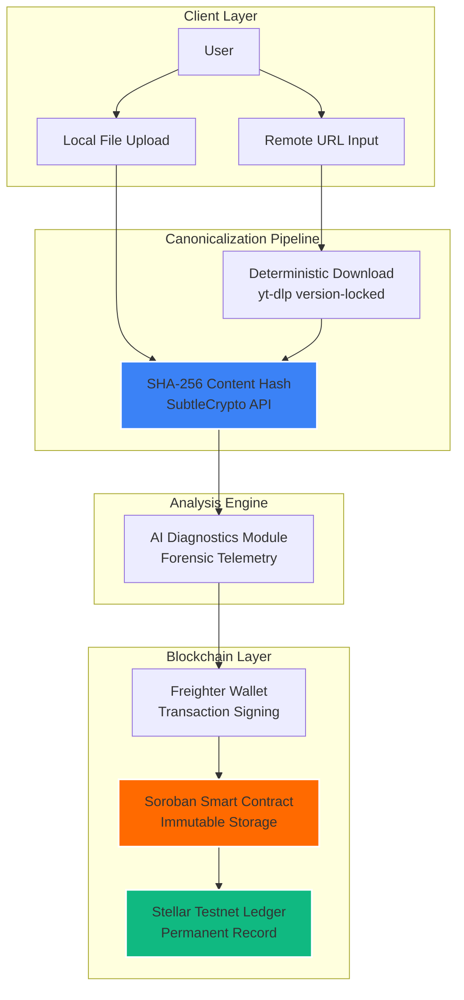
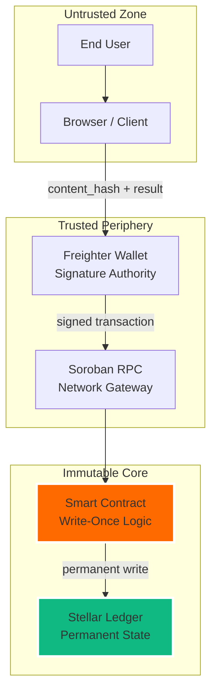

# AuthentiScan — Video Truth Infrastructure on Stellar

[](https://stellar.org)
[](https://nextjs.org)
[](https://soroban.stellar.org)
[](LICENSE)

AuthentiScan anchors AI-based video authenticity analysis results to the Stellar blockchain. The system produces **immutable, independently verifiable proof** that a specific video was analyzed at a specific time, with a specific result.

This is not a link verifier. This is a **content identity system**.

---

## Core Architectural Decision

> The project adopts a single unified identity model: **Content-Based Identity**.
> All videos, whether submitted as local files or remote URLs, are resolved into a canonical byte representation and hashed using SHA-256.
> URL string hashing is deprecated and no longer used as an identity mechanism.

**Identity = SHA-256(canonical video bytes)**
**URL = metadata reference only**

---

## System Architecture



### Data Flow

| Step | Component | Action |
|------|-----------|--------|
| 1 | Frontend | User provides video (local file or URL) |
| 2 | Pipeline | Local file: read bytes directly. URL: download via deterministic pipeline |
| 3 | Hashing | SHA-256 computed over canonical video bytes |
| 4 | Analysis | AI forensic engine evaluates authenticity |
| 5 | Signing | User signs transaction via Freighter Wallet |
| 6 | Anchoring | Smart contract stores `content_hash + analysis_result + metadata` |
| 7 | Verification | Anyone can re-hash the same bytes and query the contract |

---

## Content Identity Model

### Why Content Hash, Not URL

| Property | URL | Content Hash (SHA-256) |
|----------|-----|----------------------|
| Uniquely identifies content? | ❌ No. Same video, different URLs | ✅ Yes. Same bytes = same hash |
| Deterministic? | N/A | ✅ Cryptographically deterministic |
| Tamper-evident? | ❌ URL can point to modified content | ✅ Single bit change = completely different hash |
| Platform-independent? | ❌ Platform-specific | ✅ Universal |
| Collision resistance | N/A | ✅ 2^256 address space |

**URL is a pointer. Hash is identity.**

A URL tells you *where* something is.
A SHA-256 hash tells you *what* something is.

AuthentiScan stores *what* the content is, not *where* it was found.

### Re-Verification Flow

```
Original submission:
  Video bytes → SHA-256 → "abc123..." → anchored to Stellar

Later verification:
  Same video bytes → SHA-256 → "abc123..." → matches on-chain record ✅
  Modified video → SHA-256 → "xyz789..." → no match ❌
```

Any user with the same video file can independently verify its on-chain record. No trust in the original submitter is required. The hash is the proof.

---

## Deterministic Download Pipeline

Remote URLs are downloaded using a deterministic, version-locked pipeline to ensure byte-identical outputs for the same video ID and format.

### Pipeline Specification

```
Tool:       yt-dlp (version-locked)
Format:     best[ext=mp4] (explicit format selection)
Flags:      --no-cache-dir --no-part
Output:     Single canonical MP4 file
Hash:       SHA-256 over complete file bytes
```

### Determinism Verification

Controlled experiment performed on `2026-02-12`:

| Parameter | Download 1 | Download 2 |
|-----------|-----------|-----------|
| Video ID | `1Eo_ojxFde0` | `1Eo_ojxFde0` |
| Format | `best[ext=mp4]` | `best[ext=mp4]` |
| Size | 415,919 bytes | 415,919 bytes |
| SHA-256 | `FF655EC5...BC1081` | `FF655EC5...BC1081` |
| **Match** | ✅ **Identical** | ✅ **Identical** |

Same video ID + same format + same tool version = byte-identical output = identical hash.

---

## Smart Contract

**Network:** Stellar Testnet
**Language:** Soroban (Rust → WASM)
**Storage:** Persistent (TTL-managed)

### On-Chain Record Structure

```rust
struct VerificationRecord {
    record_id: u32,
    video_hash: BytesN<32>,     // SHA-256 content hash (identity)
    submitter: Address,          // Wallet that anchored the record
    is_ai_generated: bool,       // AI analysis verdict
    confidence_score: u32,       // Analysis confidence (0-100)
    timestamp: u64,              // Block timestamp at submission
}
```

### Contract Functions

| Function | Parameters | Description |
|----------|-----------|-------------|
| `submit_verification` | `submitter, video_hash, is_ai_generated, confidence_score` | Anchor analysis result to ledger |
| `get_verification` | `video_hash, submitter` | Query existing record by content hash |
| `get_verification_count` | — | Total number of anchored records |

### Guarantees

- **Write-once semantics:** No `update` or `delete` functions exist
- **Duplicate prevention:** Re-submitting the same hash returns existing `record_id`
- **Cryptographic authorization:** Every submission requires wallet signature (`require_auth`)
- **Immutability:** Records cannot be modified after anchoring

---

## Security Model

### Trust Architecture



### Security Properties

| Property | Mechanism | Status |
|----------|----------|--------|
| **Content integrity** | SHA-256 avalanche effect | ✅ Guaranteed |
| **Record immutability** | Stellar consensus + write-once contract | ✅ Guaranteed |
| **Submission authorization** | Freighter wallet signature | ✅ Enforced |
| **Duplicate prevention** | Hash-based storage keys | ✅ Enforced |
| **Privacy** | No raw video stored on-chain | ✅ By design |
| **Re-verification** | Hash same bytes → query contract | ✅ Deterministic |

### What This System Does NOT Do

- Does not store video content on-chain (only hashes and metadata)
- Does not guarantee AI analysis accuracy (probabilistic, not deterministic)
- Does not prevent the same video from being submitted with different byte encodings
- Does not provide legal proof (provides cryptographic evidence)

---

## Known Limitations

| Limitation | Explanation | Impact |
|------------|------------|--------|
| **Platform re-encoding** | If a platform changes video encoding, the same visual content produces a different hash | Different hash = different identity. This is correct behavior, not a bug |
| **AI is probabilistic** | Analysis confidence scores are estimates, not ground truth | Acknowledged. The blockchain anchors the *result*, not *absolute truth* |
| **Testnet deployment** | Current contract is on Stellar Testnet | Mainnet migration requires key rotation and security audit |
| **Format sensitivity** | Different download formats (720p vs 1080p) produce different hashes | By design. Each format is a different byte sequence |
| **No semantic matching** | System verifies exact content bytes, not visual similarity | Content-based, not perception-based identity |

---

## Forensic Engine

The AI diagnostic layer is currently implemented as a **Forensic Telemetry Engine (Demo Edition)**.

- **Probabilistic scoring** based on spatial and temporal analysis
- **Confidence score** represents model certainty at time of ingestion
- **Production path:** Integration with multi-modal deepfake detectors (Vision Transformers, Audio-Spectral Analysis) via decentralized oracles

> [!IMPORTANT]
> AI analysis is **probabilistic** and does not constitute definitive legal proof.
> The blockchain anchors the analysis result as immutable evidence.
> Humans remain the final auditors.

---

## Developer Quick-Start

### Prerequisites

- **Node.js** (v18+) & **npm**
- **Rust Toolchain** (with `wasm32-unknown-unknown` target)
- **Stellar CLI** ([Install Guide](https://developers.stellar.org/docs/build/smart-contracts/getting-started/setup))
- **Freighter Wallet Extension**
- **yt-dlp** (for URL video download pipeline)
- **Python 3.x** (yt-dlp dependency)

### Smart Contract Deployment

```bash
cd contract
stellar contract build

stellar network add testnet \
  --rpc-url https://soroban-testnet.stellar.org:443 \
  --network-passphrase "Test SDF Network ; September 2015"

stellar keys generate deployer --network testnet --fund

stellar contract deploy \
  --wasm target/wasm32-unknown-unknown/release/video_verification.wasm \
  --source deployer \
  --network testnet
```

Save the returned **Contract ID** for frontend configuration.

### Frontend Launch

```bash
cd frontend

# Configure environment
cat > .env.local << EOF
NEXT_PUBLIC_CONTRACT_ID=YOUR_CONTRACT_ID
NEXT_PUBLIC_SOROBAN_RPC_URL=https://soroban-testnet.stellar.org
EOF

npm install
npm run dev
```

---

## Monorepo Structure

```
block_chain_project/
├── contract/               # Soroban smart contract (Rust)
│   ├── src/lib.rs          # Contract logic
│   ├── Cargo.toml          # Rust dependencies
│   └── target/             # Compiled WASM binary
├── frontend/               # Next.js 14 application
│   ├── app/                # App Router pages
│   ├── components/         # UI components
│   ├── lib/                # Core logic
│   │   ├── hash.ts         # Local file SHA-256 hashing
│   │   ├── urlHash.ts      # URL canonicalization
│   │   ├── soroban.ts      # Stellar contract interaction
│   │   ├── mockAi.ts       # AI forensic engine
│   │   └── useWallet.ts    # Freighter wallet hook
│   └── .env.local          # Contract ID + RPC URL
└── README.md               # This document
```

---

## Key Rotation Policy

> [!WARNING]
> **Testnet → Mainnet Migration:**
> - **NEVER** reuse testnet Stellar keys on mainnet
> - Generate fresh keys using `stellar keys generate --network mainnet`
> - Store mainnet keys in secure vaults (AWS Secrets Manager, HashiCorp Vault)
> - **NEVER** commit mainnet keys to version control

---

## Developed by

**Lead Researcher:** [Tunahan Türker Ertürk](https://www.linkedin.com/in/tunahanturkererturk/)

---

© 2026 AuthentiScan Lab. Content-Based Identity. Immutable Proof. Stellar-Anchored Trust.
