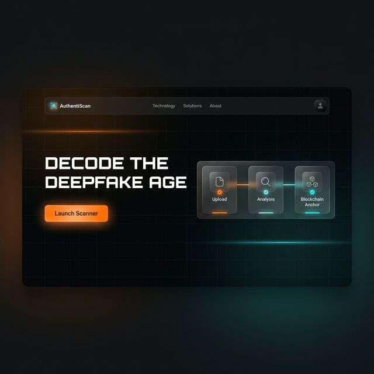
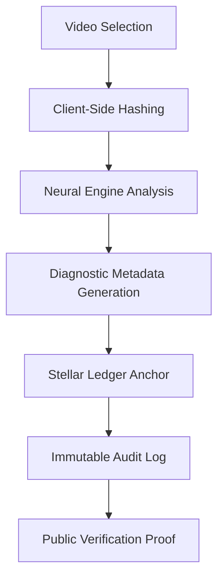
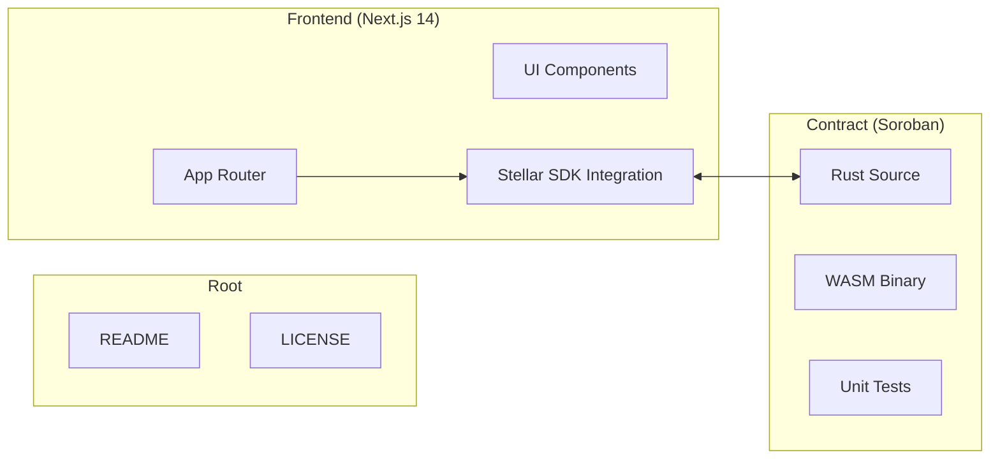

# 🛡️ AuthentiScan: Trust Infrastructure for the AI Age

[](https://stellar.org)
[](https://nextjs.org)
[](https://soroban.stellar.org)
[](LICENSE)

AuthentiScan is an industrial-grade **"Truth Anchor"** platform that converges **Advanced AI Diagnostics** with **Stellar Blockchain Immutability** to verify and secure video authenticity.

---

## 📺 System Preview



*The AuthentiScan Dashboard: Real-time telemetry meets cryptographic reliability.*

---

## 💎 Core Pillars

- **🛡️ AI Forensic Diagnostics:** Multi-modal analysis covering spatial anomalies, temporal stability, and spectral audio consistency.
- **🔗 Cryptographic Anchoring:** Every verification record generates a unique SHA-256 fingerprint anchored to the Stellar Testnet.
- **⏳ Immutable Audit Trail:** Once a record is broadcasting to the ledger, it becomes a permanent, tamper-proof record of truth.
- **👁️ Transparency First:** Integrated explorer telemetry allows anyone to verify the provenance of a video independently.

---

## 🛠️ How it Works (Interactive Flow)



### 1. Verification Journey
1.  **Ingestion:** Select a video (locally or via URL). The system performs **Zero-Knowledge Ingestion** where the file stays in your browser.
2.  **Diagnostics:** AI models scan for pixel jitters and spectral deviations.
3.  **Anchoring:** Sign a transaction via **Freighter Wallet** to store results on-chain.
4.  **Audit:** Retrieve clinical-grade proof from the Stellar Network at any time using the video hash.

---

## 🏛️ Monorepo Architecture

AuthentiScan is organized as a unified monorepo to ensure tight integration between the forensic engine and the blockchain layer.



---

## 🔒 Security & Trust Model

### 1. Client-Side Cryptography
AuthentiScan prioritizes user privacy and data integrity.
- **Privacy:** Video files never leave the client's machine. Only the calculated **SHA-256 fingerprint** is transmitted to the blockchain.
- **Integrity:** Hashing is performed using the browser's native `SubtleCrypto` API, ensuring resistance against tampering during ingestion.

### 2. On-Chain Immutability
- **Hardened Logic:** Once a verification is anchored to the Stellar ledger, it is **absolutely immutable**. The platform does not support "Update" or "Delete" operations for existing truth anchors.
- **Authorization:** Every transaction requires a cryptographic signature from a verified auditor using the **Freighter Wallet**. Unauthorized submissions are rejected at the protocol level (`require_auth`).

### 3. Global Unique Protection
- **One Truth:** The smart contract enforces global uniqueness. A specific video hash can only be verified once, preventing conflicting diagnostic reports for the same content.

---

## 🚀 Developer Quick-Start

### 1. Prerequisites
- **Node.js** (v18+) & **npm**
- **Rust Toolchain** (with `wasm32-unknown-unknown` target)
- **Stellar CLI** ([Install Guide](https://developers.stellar.org/docs/build/smart-contracts/getting-started/setup))
- **Freighter Wallet Extension**

### 2. Smart Contract Setup
```bash
# 1. Build the WASM binary
cd contract
stellar contract build

# 2. Configure network
stellar network add testnet \
  --rpc-url https://soroban-testnet.stellar.org:443 \
  --network-passphrase "Test SDF Network ; September 2015"

# 3. Deploy
stellar keys generate deployer --network testnet --fund
stellar contract deploy --wasm target/wasm32-unknown-unknown/release/video_verification.wasm --source deployer --network testnet
```
*Note: Save the returned **Contract ID** for the frontend setup.*

### 3. Frontend Launch
1.  **Config:** Create `frontend/.env.local`
    ```env
    NEXT_PUBLIC_CONTRACT_ID=YOUR_CONTRACT_ID
    NEXT_PUBLIC_SOROBAN_RPC_URL=https://soroban-testnet.stellar.org
    ```
2.  **Run:**
    ```bash
    cd frontend
    npm install
    npm run dev
    ```

---

## ⚖️ Forensic Accuracy Notice

> [!IMPORTANT]
> AI analysis is **probabilistic** and does not constitute definitive legal proof of authenticity. Final judgment should be supported by multi-modal forensic evidence. This platform provides the **Infrastructure of Trust**, but humans remain the final auditors.

---

## 👨‍💻 Developed by
**Lead Researcher:** [Tunahan Türker Ertürk](https://www.linkedin.com/in/tunahanturkererturk/)

---
© 2026 AuthentiScan Lab. Secure. Immutable. Verifiable.
