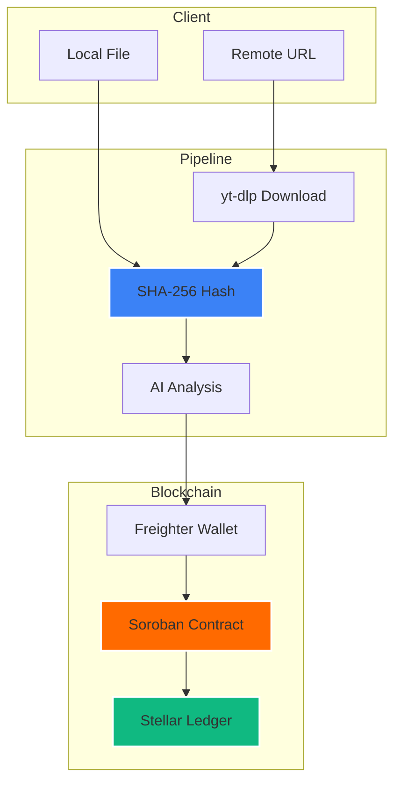

# AuthentiScan — Video Truth Infrastructure on Stellar

[](https://stellar.org)
[](https://nextjs.org)
[](https://soroban.stellar.org)
[](LICENSE)

AuthentiScan is a full-stack Stellar dApp that anchors AI-based video authenticity analysis results to the blockchain. Users upload a video (or provide a URL), the system computes a SHA-256 content hash, runs AI forensic analysis, and writes the result immutably to a Soroban smart contract on Stellar Testnet. Anyone with the same video file can independently verify the on-chain record.

> **Tech Stack:** Next.js 14 · Soroban/Rust · Stellar Testnet · Freighter Wallet · SHA-256 · yt-dlp

---

## Features

- 🔐 **Content-Based Identity** — Video identity = SHA-256 hash of bytes, not URLs
- 🤖 **AI Forensic Analysis** — Probabilistic deepfake detection with confidence scoring
- ⛓️ **Stellar Blockchain Anchoring** — Write-once, immutable on-chain records
- 🔍 **Auto-Verification** — Automatic blockchain lookup when a hash is computed
- 📜 **Verification History** — Local audit trail with Stellar Explorer links
- 🔒 **Wallet-Signed Submissions** — Every record requires Freighter wallet authorization
- 📎 **Dual Input** — Local file upload or remote URL with deterministic download
- ⚡ **Re-Verification** — Same bytes → same hash → same on-chain proof

---

## Core Architectural Decision

The project uses **Content-Based Identity**: all videos are resolved into canonical bytes and hashed with SHA-256. The hash is the identity. URLs are metadata references only. See [docs/experiments.md](docs/experiments.md) for determinism verification data.

---

## Architecture



| Step | What Happens |
|------|-------------|
| 1 | User provides video (file or URL) |
| 2 | SHA-256 content hash computed |
| 3 | AI forensic engine evaluates authenticity |
| 4 | User signs transaction via Freighter |
| 5 | Smart contract stores hash + result immutably |
| 6 | Anyone can re-hash same bytes to verify |

---

## Smart Contract

| Function | Description |
|----------|-------------|
| `submit_verification` | Anchor analysis result to ledger |
| `get_verification` | Query record by content hash |
| `get_verification_count` | Total anchored records |

**Guarantees:** Write-once (no update/delete) · Duplicate prevention · Wallet signature required

→ Full API, Rust struct, error codes, deploy scripts: [contract/README.md](contract/README.md)

---

## Quick Start

### Prerequisites

- Node.js v18+ & npm
- Rust with `wasm32-unknown-unknown` target
- [Stellar CLI](https://developers.stellar.org/docs/build/smart-contracts/getting-started/setup)
- [Freighter Wallet](https://freighter.app/)

### Deploy Contract

```bash
cd contract
stellar contract build
stellar network add testnet \
  --rpc-url https://soroban-testnet.stellar.org:443 \
  --network-passphrase "Test SDF Network ; September 2015"
stellar keys generate deployer --network testnet --fund
stellar contract deploy \
  --wasm target/wasm32-unknown-unknown/release/video_verification.wasm \
  --source deployer --network testnet
# Save the returned Contract ID
```

### Run Frontend

```bash
cd frontend
echo "NEXT_PUBLIC_CONTRACT_ID=YOUR_CONTRACT_ID" > .env.local
echo "NEXT_PUBLIC_SOROBAN_RPC_URL=https://soroban-testnet.stellar.org" >> .env.local
npm install && npm run dev
```

---

## Security & Limitations

- **Content integrity:** SHA-256 guarantees tamper detection
- **Immutability:** Stellar consensus + write-once contract
- **Privacy:** No raw video stored on-chain
- **AI is probabilistic:** Confidence scores are estimates, not ground truth
- **Platform re-encoding:** Same visual content may produce different hashes after re-encode
- ⚠️ Testnet keys must **never** be reused on mainnet

→ Full security model, threat architecture, key rotation: [SECURITY.md](SECURITY.md)

---

## Project Structure

```
block_chain_project/
├── contract/               # Soroban smart contract (Rust)
│   ├── src/lib.rs          # Contract logic
│   └── README.md           # Full contract API docs
├── frontend/               # Next.js 14 application
│   ├── app/                # App Router pages
│   ├── components/         # UI components
│   └── lib/                # Core modules (hash, soroban, wallet)
├── docs/
│   └── experiments.md      # Download determinism experiments
├── SECURITY.md             # Security model & key rotation
└── README.md               # ← You are here
```

---

## Contributing

1. Fork the repository
2. Create a feature branch (`git checkout -b feature/my-feature`)
3. Commit changes (`git commit -m 'feat: add my feature'`)
4. Push to branch (`git push origin feature/my-feature`)
5. Open a Pull Request

---

## Developed by

**Tunahan Türker Ertürk** — [LinkedIn](https://www.linkedin.com/in/tunahanturkererturk/)

## License

MIT — see [LICENSE](LICENSE) for details.
