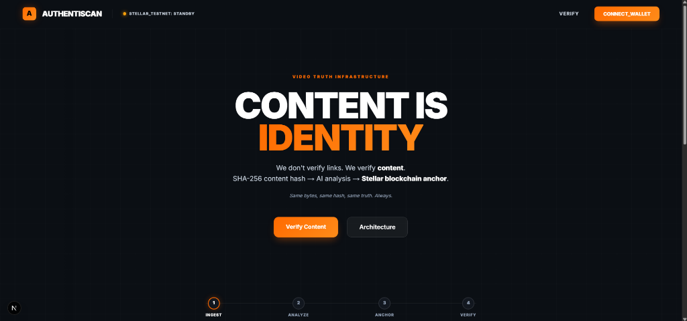
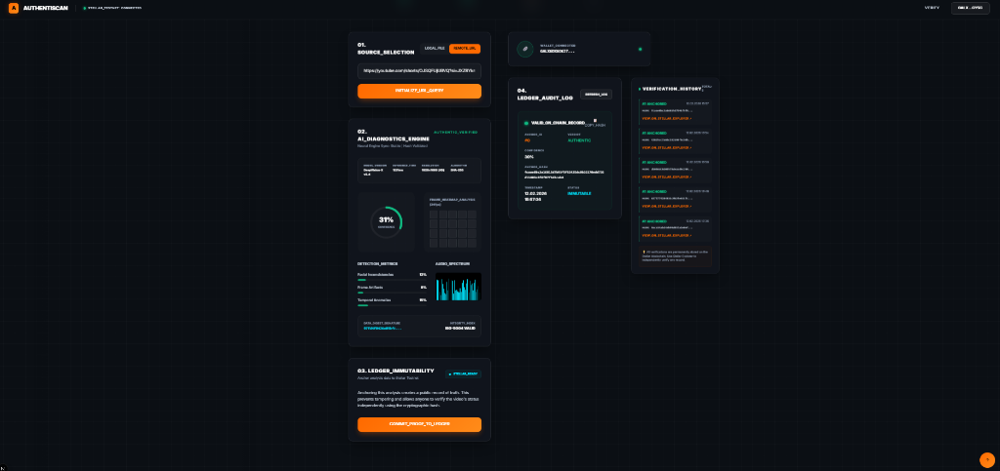
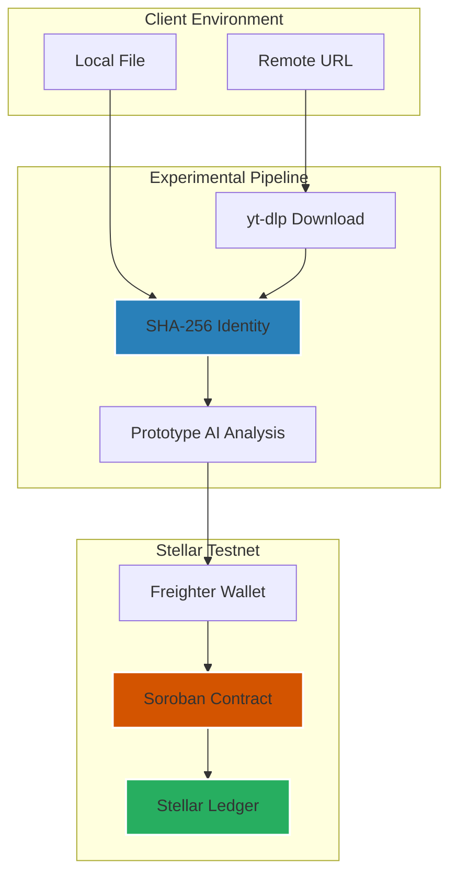

# AuthentiScan: Video Authenticity Prototype

[](https://stellar.org)
[](https://nextjs.org)
[](https://soroban.stellar.org)
[](LICENSE)

AuthentiScan is an experimental full-stack dApp that demonstrates anchoring video authenticity findings to the blockchain. Users can upload a video or provide a URL to compute a **Content-Based Identity** (SHA-256 hash), which is then processed by a **Prototype AI Analysis** module and stored as an immutable **Verification Record** on a Soroban smart contract.

> [!CAUTION]
> **Prototype Only:** This project is an experimental demonstration currently deployed on the **Stellar Testnet**. It is not suitable for legal verification, judicial proof, or production use. No professional security audit has been performed.



---

## Core Features (Prototype)

- **Content-Based Identity** — Videos are identified by the SHA-256 hash of their raw bytes rather than transient URLs or filenames.
- **Prototype AI Analysis** — A mock forensic module provides simulated authenticity scores for demonstration purposes.
- **Stellar Testnet Anchoring** — Immutable recording of **Verification Records** to Soroban smart contracts.
- **Auto-Verification** — Automatic blockchain lookup for previously anchored content hashes.
- **Audit Interface** — Transparency into records with direct links to public Stellar Explorers.
- **Wallet Authorization** — Submissions require cryptographic signatures via the Freighter wallet.
- **Deterministic Processing** — Consistent hash generation for remote URLs using specific tool configurations.



---

## Architecture



---

## Smart Contract

The Soroban contract manages the storage and retrieval of **Verification Records**.

| Function | Description |
|----------|-------------|
| `submit_verification` | Anchor a new **Verification Record** to the ledger |
| `get_verification` | Query an existing record by **Content-Based Identity** |
| `get_verification_count` | Total number of records anchored during this experiment |

**Technical Specifications:**
- **Immutability:** Records are write-once; no update or delete functionality is implemented.
- **Unique Identification:** The contract uses the SHA-256 hash as a primary key to prevent duplicate entries.
- **Auth Enforcement:** The contract uses the `require_auth` pattern to verify transaction signers.

→ Full API documentation and deployment guides: [contract/README.md](contract/README.md)

---

## Quick Start (Demo Setup)

### Prerequisites

| Tool | Requirement | Verification |
|------|-------------|--------------|
| **Node.js** | v18+ | `node -v` |
| **Rust** | v1.71+ | `rustc --version` |
| **Stellar CLI** | Recent | `stellar --version` |
| **yt-dlp** | Latest | `yt-dlp --version` |
| **WASM Target** | - | `rustup target add wasm32-unknown-unknown` |

### 1. Build & Deploy Contract

```bash
cd contract
stellar contract build

# Configure testnet
stellar network add testnet \
  --rpc-url https://soroban-testnet.stellar.org:443 \
  --network-passphrase "Test SDF Network ; September 2015"

# Setup keys
stellar keys generate deployer --network testnet --fund

# Deploy
stellar contract deploy \
  --wasm target/wasm32-unknown-unknown/release/video_verification.wasm \
  --source deployer --network testnet
```

### 2. Run Prototype Frontend

```bash
cd frontend

# Setup environment
echo "NEXT_PUBLIC_CONTRACT_ID=YOUR_CONTRACT_ID" > .env.local
echo "NEXT_PUBLIC_SOROBAN_RPC_URL=https://soroban-testnet.stellar.org" >> .env.local

npm install
npm run dev
```

---

## Scope & Limitations

- **Probabilistic Results**: The **Prototype AI Analysis** provides simulated confidence scores. Real forensic accuracy is a planned future enhancement.
- **Byte Sensitivity**: This system is content-based, not perception-based. Re-encoding or compressing a video changes its **Content-Based Identity**.
- **Privacy Assurance**: No raw video content is uploaded to the blockchain. Only the SHA-256 hash and metadata are recorded.
- **Network Status**: Currently restricted to the **Stellar Testnet**.

---

## Project Info

**Developed by:** Tunahan Türker Ertürk — [LinkedIn](https://www.linkedin.com/in/tunahanturkererturk/)  
**License:** MIT

---
*© 2026 AuthentiScan — Experimental Research Prototype*
