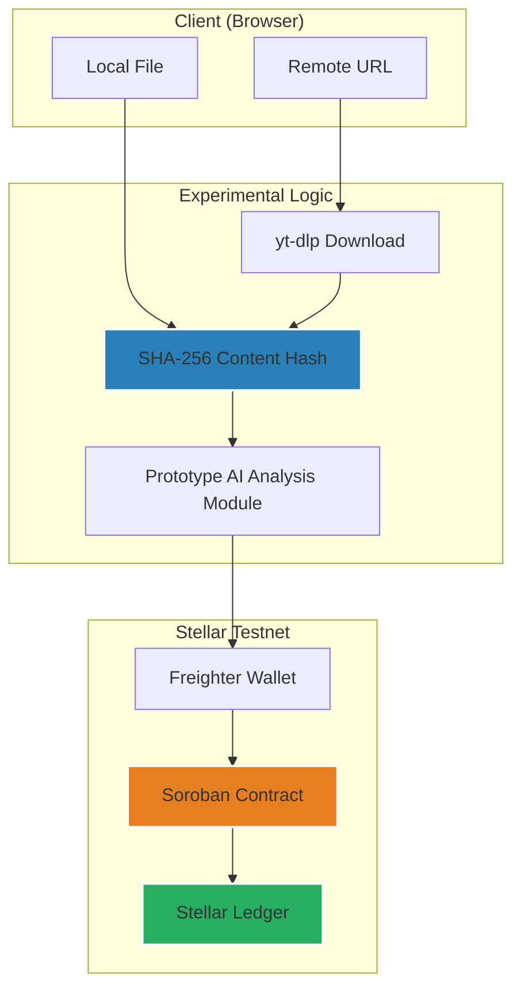

# AuthentiScan: Video Authenticity Prototype

[](https://stellar.org)
[](https://nextjs.org)
[](https://soroban.stellar.org)
[](LICENSE)

AuthentiScan is an experimental full-stack dApp that demonstrates the anchoring of video authenticity metadata to the blockchain. Users can upload a video or provide a URL to compute a **SHA-256 Content Hash**, which is then used as a **Content-Based Identity**. This identity is processed by a **Prototype AI Analysis Module (Simulated)** and anchored as an immutable **Verification Record** on a Soroban smart contract.

> [!NOTE]
> This project is a **functional prototype** currently deployed on the **Stellar Testnet**. It is intended for research and demonstration purposes and is not yet suitable for production use or as a source of legal proof.


## 🎥 Demo Video
This short demo showcases the AuthentiScan prototype running on the Stellar Testnet, including hashing, simulated AI analysis, and on-chain anchoring.

[▶️ Watch on YouTube](https://www.youtube.com/watch?v=dQZeowQIR2Y)

---

## Prototype Features

- **Content-Based Identity** — Videos are identified by the **SHA-256 Content Hash** of their raw bytes rather than transient URLs or filenames.
- **Prototype AI Analysis** — An experimental module provides probabilistic authenticity scores (simulated for demonstration).
- **Stellar Testnet Anchoring** — Immutable recording of **Verification Records** to Soroban smart contracts.
- **Auto-Verification** — Automatic blockchain lookup for previously anchored **SHA-256 Content Hashes**.
- **Audit Logging** — Visibility into anchored records with direct links to public Stellar Explorers.
- **Wallet Authorization** — Submissions require cryptographic signatures via the Freighter wallet.
- **Deterministic Pipeline** — Consistent hash generation for remote URLs using version-locked tools.


---

## Technical Concept: Content-Based Identity

AuthentiScan prioritizes **Content-Based Identity**. All video inputs are resolved into canonical byte sequences and hashed using the **SHA-256 Content Hash**. The hash serves as the unique identifier, ensuring that the same video produces the same **Verification Record** regardless of its location.

See [docs/experiments.md](docs/experiments.md) for detailed determinism verification data.

---

## Architecture



---

## Smart Contract

The Soroban contract manages the lifecycle of a **Verification Record** using the **SHA-256 Content Hash** as the primary key.

| Function | Description |
|----------|-------------|
| `submit_verification` | Anchor analysis findings to the ledger |
| `get_verification` | Query an existing **Verification Record** by hash |
| `get_verification_count` | Total number of anchored records |

**Technical Properties:**
- **Immutability:** Records are write-once; no update or delete functions exist.
- **Unique Keying:** The contract prevents duplicate entries for the same **SHA-256 Content Hash**.
- **Auth Enforcement:** Uses the `require_auth` pattern to verify transaction signers.

→ Full API documentation and deployment guides: [contract/README.md](contract/README.md)

---

## Quick Start (Demo Setup)

### Prerequisites

| Tool | Recommended Version | Verification Command |
|------|---------------------|----------------------|
| **Node.js** | v18+ | `node -v` |
| **Rust** | v1.71+ | `rustc --version` |
| **Stellar CLI** | Recent | `stellar --version` |
| **yt-dlp** | Latest | `yt-dlp --version` |
| **WASM Target** | - | `rustup target add wasm32-unknown-unknown` |

### 1. Build & Deploy Contract

```bash
cd contract
stellar contract build

# Configure testnet
stellar network add testnet \
  --rpc-url https://soroban-testnet.stellar.org:443 \
  --network-passphrase "Test SDF Network ; September 2015"

# Setup deployer
stellar keys generate deployer --network testnet --fund

# Deploy
stellar contract deploy \
  --wasm target/wasm32-unknown-unknown/release/video_verification.wasm \
  --source deployer --network testnet
```

### 2. Run Prototype Frontend

```bash
cd frontend

# Setup environment
echo "NEXT_PUBLIC_CONTRACT_ID=YOUR_CONTRACT_ID" > .env.local
echo "NEXT_PUBLIC_SOROBAN_RPC_URL=https://soroban-testnet.stellar.org" >> .env.local

npm install
npm run dev
```

---

## Scope & Constraints

- **AI Module**: The **Prototype AI Analysis** provides simulated confidence scores. Real forensic inferencing is a planned future enhancement.
- **Hash Sensitivity**: This system identifies bitstreams. Any modification to the video file (e.g., transcoding) will change the **SHA-256 Content Hash**.
- **Privacy Assurance**: No video content is uploaded to the chain. Only fingerprints are submitted.
- **Stellar Testnet**: Current deployment is restricted to the testnet environment.

---

## Project Status

**Developed by:** Tunahan Türker Ertürk — [LinkedIn](https://www.linkedin.com/in/tunahanturkererturk/)  
**License:** MIT

---
*© 2026 AuthentiScan — Experimental Research Prototype*
