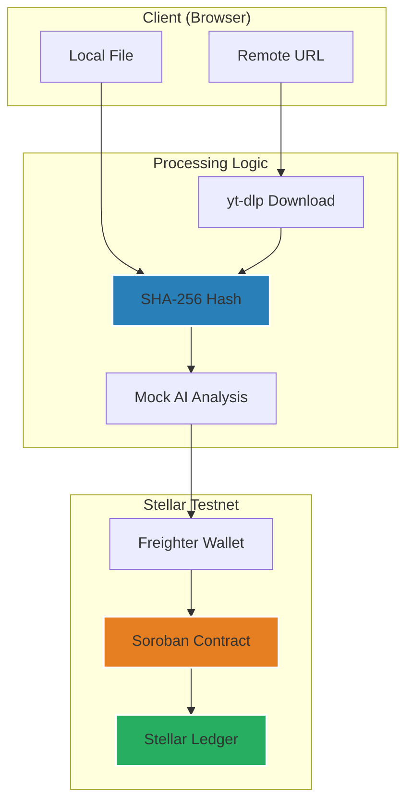

# AuthentiScan — Video Authenticity Prototype on Stellar

[](https://stellar.org)
[](https://nextjs.org)
[](https://soroban.stellar.org)
[](LICENSE)

AuthentiScan is an experimental full-stack dApp that demonstrates anchoring video authenticity metadata to the Stellar blockchain. Users can upload a video or provide a URL to compute a SHA-256 content hash, which is then processed by a prototype AI analysis module and recorded immutably on a Soroban smart contract.

> [!NOTE]
> This project is a **functional prototype** and is currently deployed on **Stellar Testnet**. It is intended for demonstration purposes and is not yet suitable for production use or as a source of legal proof.


---

## Features

- **Content-Based Identity** — Videos are identified by the SHA-256 hash of their raw bytes rather than transient URLs.
- **Experimental AI Analysis** — A prototype forensic module provides probabilistic authenticity scores (simulated for demonstration).
- **Stellar Ledger Anchoring** — Immutable recording of verification metadata to Soroban smart contracts.
- **Auto-Verification** — Automatic blockchain lookup for previously anchored video hashes.
- **Audit Trail** — Visibility into anchored records with direct links to Stellar Explorers.
- **Wallet Authorization** — Submissions are signed and authorized via the Freighter wallet.
- **Deterministic Pipeline** — Consistent hash generation for remote URLs using version-locked tools.


---

## Technical Concept: Content-Based Identity

AuthentiScan prioritizes **Content-Based Identity**. All video inputs are resolved into canonical byte sequences and hashed. The hash serves as the unique identifier, ensuring that the same video produces the same on-chain record regardless of its location or filename.

See [docs/experiments.md](docs/experiments.md) for detailed determinism verification data.

---

## Architecture



---

## Smart Contract

The Soroban contract provides a minimalist API for anchoring and retrieving authenticity records.

| Function | Description |
|----------|-------------|
| `submit_verification` | Anchor analysis metadata to the ledger |
| `get_verification` | Query an existing record by content hash |
| `get_verification_count` | Retrieve the total number of anchored records |

**Technical Guarantees:**
- **Immutability:** Records are write-once; no update or delete functions exist.
- **Uniqueness:** The contract prevents duplicate entries for the same content hash.

→ Full API documentation and deployment guides: [contract/README.md](contract/README.md)

---

## Quick Start

### Prerequisites

| Tool | Recommended Version | Verification Command |
|------|---------------------|----------------------|
| **Node.js** | v18+ | `node -v` |
| **Rust** | v1.71+ | `rustc --version` |
| **Stellar CLI** | Latest | `stellar --version` |
| **yt-dlp** | Latest | `yt-dlp --version` |
| **WASM Target** | - | `rustup target add wasm32-unknown-unknown` |

### 1. Deploy Contract (Testnet)

```bash
cd contract
stellar contract build

# Configure testnet
stellar network add testnet \
  --rpc-url https://soroban-testnet.stellar.org:443 \
  --network-passphrase "Test SDF Network ; September 2015"

# Setup deployer
stellar keys generate deployer --network testnet --fund

# Deploy
stellar contract deploy \
  --wasm target/wasm32-unknown-unknown/release/video_verification.wasm \
  --source deployer --network testnet
```

### 2. Run Frontend

```bash
cd frontend

# Setup environment
echo "NEXT_PUBLIC_CONTRACT_ID=YOUR_CONTRACT_ID" > .env.local
echo "NEXT_PUBLIC_SOROBAN_RPC_URL=https://soroban-testnet.stellar.org" >> .env.local

npm install
npm run dev
```

---

## Limitations & Project Scope

- **AI Accuracy**: The forensic engine is a prototype module. Results are probabilistic and intended for demonstration.
- **Re-encoding**: Significant visual changes or re-encodes will result in different hashes.
- **Testnet Status**: This project is currenty on Stellar Testnet for experimentation.

→ For the full security model and threat assessment, see [SECURITY.md](SECURITY.md).

---

## Developed by

**Tunahan Türker Ertürk** — [LinkedIn](https://www.linkedin.com/in/tunahanturkererturk/)

## License

MIT — see [LICENSE](LICENSE) for details.

---
*© 2026 AuthentiScan (Experimental Prototype by Tunahan Türker Ertürk)*
