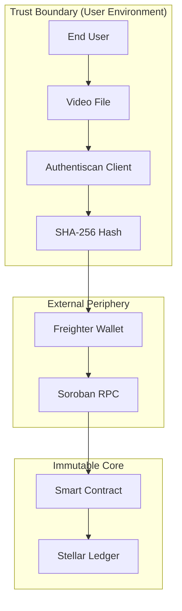
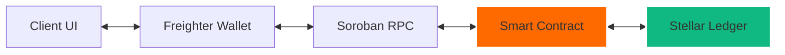

# 🛡️ AuthentiScan: Trust Infrastructure for the AI Age

[](https://stellar.org)
[](https://nextjs.org)
[](https://soroban.stellar.org)
[](LICENSE)

AuthentiScan is an industrial-grade **"Truth Anchor"** platform that converges **Advanced AI Diagnostics** with **Stellar Blockchain Immutability** to verify and secure video authenticity.

---

## 📺 System Preview


*The AuthentiScan Dashboard: Real-time telemetry meets cryptographic reliability.*

---

## 💎 Core Pillars

- **🛡️ AI Forensic Diagnostics:** Multi-modal analysis covering spatial anomalies, temporal stability, and spectral audio consistency.
- **🔗 Cryptographic Anchoring:** Every verification record generates a unique SHA-256 fingerprint anchored to the Stellar Testnet.
- **⏳ Immutable Audit Trail:** Once a record is broadcasting to the ledger, it becomes a permanent, tamper-proof record of truth.
- **👁️ Transparency First:** Integrated explorer telemetry allows anyone to verify the provenance of a video independently.

---

## 🛠️ How it Works (Interactive Flow)


### 1. Verification Journey
1.  **Ingestion:** Select a video (locally or via URL). The system performs **Zero-Knowledge Ingestion** where the file stays in your browser.
2.  **Diagnostics:** AI models scan for pixel jitters and spectral deviations.
3.  **Anchoring:** Sign a transaction via **Freighter Wallet** to store results on-chain.
4.  **Audit:** Retrieve clinical-grade proof from the Stellar Network at any time using the video hash.

---

## 🏛️ Monorepo Architecture

AuthentiScan is organized as a unified monorepo to ensure tight integration between the forensic engine and the blockchain layer.


---

## 🌐 System Boundary Diagram

The system boundary illustrates the trust perimeter. Authentiscan acts as a thin, non-custodial gateway between the user's private media and the public ledger.



---

## 🔒 Security & Trust Model

### 1. Client-Side Cryptography
AuthentiScan prioritizes user privacy and data integrity.
- **Privacy:** Video files never leave the client's machine. Only the calculated **SHA-256 fingerprint** is transmitted to the blockchain.
- **Integrity:** Hashing is performed using the browser's native `SubtleCrypto` API, ensuring resistance against tampering during ingestion.

### 2. On-Chain Immutability
- **Hardened Logic:** Once a verification is anchored to the Stellar ledger, it is **absolutely immutable**. The platform does not support "Update" or "Delete" operations for existing truth anchors.
- **Authorization:** Every transaction requires a cryptographic signature from a verified auditor using the **Freighter Wallet**. Unauthorized submissions are rejected at the protocol level (`require_auth`).

### 3. Global Unique Protection
- **One Truth:** The smart contract enforces global uniqueness. A specific video hash can only be verified once, preventing conflicting diagnostic reports for the same content.

---

---

## 🛡️ Threat Model & Security Disclosures

AuthentiScan operates under a strictly defined security model designed for transparency and risk awareness.

### 🔐 Security Guarantees

#### 1. Client-Side Hashing Only
- **Privacy:** Video files **never leave the client's browser**. Only the SHA-256 fingerprint is transmitted.
- **Integrity:** Hashing uses the browser's native `SubtleCrypto` API, resistant to tampering.
- **No On-Chain Storage:** The blockchain stores only cryptographic hashes and metadata—never raw video data.

#### 2. Blockchain Immutability
- **Absolute Immutability:** Once anchored to the Stellar ledger, records are **permanent and tamper-proof**.
- **No Update/Delete:** The smart contract enforces write-once semantics. No `update_verification` function exists.
- **Cryptographic Authorization:** Every transaction requires a signature from the submitter's wallet (`require_auth`).

#### 3. Global Duplicate Prevention
- **One Hash, One Truth:** The smart contract enforces global uniqueness at the storage layer.
- **Idempotent Behavior:** Re-submitting the same video hash returns the existing `record_id` without creating duplicates.
- **No State Overwrite:** Storage keys use `DataKey::Verification(video_hash)` to prevent collision.

### ⚠️ Known Limitations & Risks

| Risk Factor | Mitigation | Residual Risk |
|-------------|-----------|---------------|
| **Hash Collisions** | SHA-256 provides 2^256 address space—collision probability is negligible (< 10^-60) | 🟢 NEGLIGIBLE |
| **Probabilistic AI** | AI diagnostics are **probabilistic estimates**, not definitive legal proof | 🟡 ACKNOWLEDGED |
| **Frontend Tampering** | Client UI can be modified, but **on-chain records are authoritative** and cryptographically signed | 🟡 MITIGATED |
| **Data Privacy** | No video data stored on-chain; only hashes and metadata | 🟢 PROTECTED |
| **Testnet Keys** | **CRITICAL:** Testnet keys must be rotated before mainnet deployment | 🔴 REQUIRES ACTION |
| **Rate Limiting** | Current demo lacks anti-spam mechanisms | 🟡 FUTURE WORK |

### 🔑 Key Rotation Requirements

> [!WARNING]
> **Testnet → Mainnet Migration:**
> - **NEVER** reuse testnet Stellar keys on mainnet
> - Generate fresh keys using `stellar keys generate --network mainnet`
> - Store mainnet keys in secure vaults (e.g., AWS Secrets Manager, HashiCorp Vault)
> - **NEVER** commit mainnet keys to Git

### 🚀 Production Roadmap

Future production iterations will include:
- **Multi-Signature Consensus:** Require multiple auditor signatures for high-stakes verifications
- **Rate Limiting:** Prevent spam and Sybil attacks at the RPC layer
- **Anti-Spam Mechanisms:** Fee-based submission or proof-of-work challenges
- **Decentralized Oracles:** Integrate multi-modal AI models via Chainlink or similar

### 🎯 Trust Boundaries

```mermaid
graph TD
    subgraph "🔓 Untrusted Zone"
        U[End User]
        B[Browser]
        UI[AuthentiScan UI]
    end
    
    subgraph "🔐 Trusted Periphery"
        W[Freighter Wallet]
        RPC[Soroban RPC]
    end
    
    subgraph "⚡ Immutable Core"
        SC[Smart Contract<br/>Duplicate Guard<br/>Immutable State]
        L[Stellar Ledger<br/>Permanent Record]
    end
    
    U --> B
    B --> UI
    UI -->|SHA-256 Hash| W
    W -->|Signed TX| RPC
    RPC --> SC
    SC -->|Write-Once| L
    
    style SC fill:#ff6a00,stroke:#fff,stroke-width:3px
    style L fill:#10b981,stroke:#fff,stroke-width:3px
```



**Key Insight:** Only the **Immutable Core** (Smart Contract + Ledger) provides cryptographic guarantees. The client UI is a convenience layer—**always verify on-chain**.

---

## 🗺️ System Interaction Flow

The following lifecycle diagram illustrates how AuthentiScan bridges the gap between local forensic analysis and decentralized consensus.



---

## 🚀 Developer Quick-Start

### 1. Prerequisites
- **Node.js** (v18+) & **npm**
- **Rust Toolchain** (with `wasm32-unknown-unknown` target)
- **Stellar CLI** ([Install Guide](https://developers.stellar.org/docs/build/smart-contracts/getting-started/setup))
- **Freighter Wallet Extension**

### 2. Smart Contract Setup
```bash
# 1. Build the WASM binary
cd contract
stellar contract build

# 2. Configure network
stellar network add testnet \
  --rpc-url https://soroban-testnet.stellar.org:443 \
  --network-passphrase "Test SDF Network ; September 2015"
## 🔬 Forensic Engine (AI Layer)

The current AI diagnostic layer is implemented as a **Forensic Telemetry Engine (Demo Edition)**.
- **Probabilistic Scoring:** Decisions are made based on spectral and spatial probability distributions.
- **Verification Metadata:** The confidence score represents the model's certainty at the time of ingestion.
- **Production Note:** A production-ready environment would integrate multi-modal deepfake detectors (Vision Transformers, Audio-Spectral Analysis) via decentralized oracles.

---

# 3. Deploy
stellar keys generate deployer --network testnet --fund
stellar contract deploy --wasm target/wasm32-unknown-unknown/release/video_verification.wasm --source deployer --network testnet
```
*Note: Save the returned **Contract ID** for the frontend setup.*

### 3. Frontend Launch
1.  **Config:** Create `frontend/.env.local`
    ```env
    NEXT_PUBLIC_CONTRACT_ID=YOUR_CONTRACT_ID
    NEXT_PUBLIC_SOROBAN_RPC_URL=https://soroban-testnet.stellar.org
    ```
2.  **Run:**
    ```bash
    cd frontend
    npm install
    npm run dev
    ```

---

## ⚖️ Forensic Accuracy Notice

> [!IMPORTANT]
> AI analysis is **probabilistic** and does not constitute definitive legal proof of authenticity. Final judgment should be supported by multi-modal forensic evidence. This platform provides the **Infrastructure of Trust**, but humans remain the final auditors.

---

## 👨‍💻 Developed by
**Lead Researcher:** [Tunahan Türker Ertürk](https://www.linkedin.com/in/tunahanturkererturk/)

---
© 2026 AuthentiScan Lab. Secure. Immutable. Verifiable.
