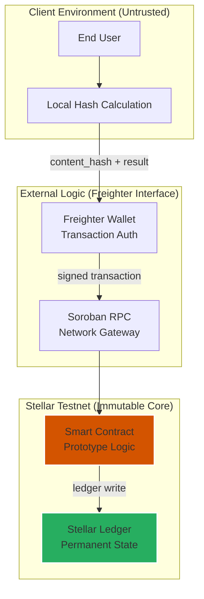

# Security Model: AuthentiScan Prototype

This document provides a technical overview of the security architecture and trust assumptions for the AuthentiScan project. As an **experimental prototype** deployed on the **Stellar Testnet**, it is designed to demonstrate concepts rather than provide production-grade security guarantees.

## Trust Architecture

The system utilizes a layered trust model where security is anchored at the ledger level.

## Security Properties (Prototype)

| Property | Implementation Method | Status |
|----------|----------|--------|
| **Content integrity** | **SHA-256 Content Hash** | ✅ Demonstrated |
| **Record immutability** | Stellar Ledger + Write-Once Logic | ✅ Demonstrated |
| **Submission Auth** | Freighter Wallet `require_auth` | ✅ Enforced |
| **Duplicate Prevention** | Hash-Based Storage Keys | ✅ Enforced |
| **Data Privacy** | Local Hashing (No video data on-chain) | ✅ By Design |

## Key Disclosures

- **Non-Judicial Utility**: The **Verification Records** anchored by this system are experimental indicators and do not constitute legal or judicial proof of authenticity.
- **Probabilistic Findings**: Results from the **Prototype AI Analysis Module** are estimates. The blockchain anchors the *finding*, not the absolute truth.
- **No Formal Audit**: This project has not undergone a professional third-party security audit.
- **Identity Sensitivity**: The **Content-Based Identity** is derived from exact bitstreams. Visual duplicates with different encodings will produce different hashes.

## Known Constraints

| Constraint | Explanation | Impact |
|-----------|-----------|--------|
| **Re-encoding sensitivity** | Modern video platforms transcode uploads, changing the byte sequence. | Visual duplicates may resolve to different **Verification Records**. |
| **Simulated Indicators** | Forensic metrics are currently generated by a **Prototype AI Analysis Module**. | Demonstrated vision of capability rather than real forensic detection. |
| **Client Side Risks** | Hashing occurs in the user's browser environment. | Potential for malicious input if the browser environment is compromised. |

---
*© 2026 AuthentiScan — Experimental Research Prototype*
