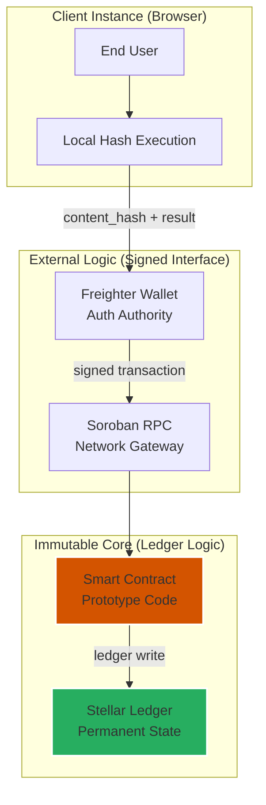

# Security Model: AuthentiScan Prototype

This document outlines the security architecture and trust assumptions for the AuthentiScan project. As an **experimental prototype** deployed on the **Stellar Testnet**, it is designed to demonstrate concepts rather than provide production-ready security guarantees.

## Trust Architecture

## Security Properties (Prototype)

| Property | Mechanism | Status |
|----------|----------|--------|
| **Content Integrity** | SHA-256 **Content-Based Identity** | ✅ Demonstrated |
| **Record Immutability** | Stellar Ledger + Write-Once Logic | ✅ Demonstrated |
| **Submission Auth** | Freighter Wallet `require_auth` | ✅ Enforced |
| **Duplicate Prevention** | Hash-Based Storage Keys | ✅ Enforced |
| **Data Privacy** | Local Hashing (No raw video on-chain) | ✅ By Design |

## Disclosure of Limitations

- **Not for Legal Use**: The **Verification Records** anchored by this system are experimental and do not constitute legal or judicial proof of authenticity.
- **Probabilistic AI**: The **Prototype AI Analysis** uses mock forensic data. Real-world accuracy is not guaranteed in this version.
- **No Professional Audit**: This project's code (contract and frontend) has not undergone a professional third-party security audit.
- **Hash-Based Identification**: The system identifies bitstreams. Any modification to the video file (e.g., metadata change or re-compression) will result in a new **Content-Based Identity**.

---

## Technical Constraints

| Constraint | Reason | Impact |
|-----------|-----------|--------|
| **Platform Transcoding** | Video platforms often re-encode files after upload. | Visual duplicates may produce different **Content-Based Identity** fingerprints. |
| **Endpoint Security** | Hashing occurs in the user's browser environment. | Compromised client environments could manipulate analysis inputs before submission. |
| **Testnet Dependency** | Currently limited to the **Stellar Testnet**. | Infrastructure is subject to the stability and state resets of the Testnet. |

---
*© 2026 AuthentiScan — Experimental Research Prototype*
