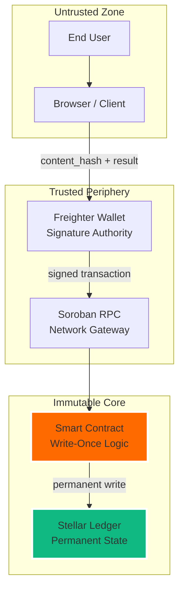

# Security Model — AuthentiScan

## Trust Architecture

## Security Properties

| Property | Mechanism | Status |
|----------|----------|--------|
| **Content integrity** | SHA-256 avalanche effect | ✅ Guaranteed |
| **Record immutability** | Stellar consensus + write-once contract | ✅ Guaranteed |
| **Submission authorization** | Freighter wallet signature | ✅ Enforced |
| **Duplicate prevention** | Hash-based storage keys | ✅ Enforced |
| **Privacy** | No raw video stored on-chain | ✅ By design |
| **Re-verification** | Hash same bytes → query contract | ✅ Deterministic |

## What This System Does NOT Do

- Does not store video content on-chain (only hashes and metadata)
- Does not guarantee AI analysis accuracy (probabilistic, not deterministic)
- Does not prevent the same video from being submitted with different byte encodings
- Does not provide legal proof (provides cryptographic evidence)

## Known Limitations

| Limitation | Explanation | Impact |
|-----------|-----------|--------|
| **Platform re-encoding** | If a platform changes video encoding, the same visual content produces a different hash | Different hash = different identity. Correct behavior |
| **AI is probabilistic** | Analysis confidence scores are estimates, not ground truth | Blockchain anchors the *result*, not *absolute truth* |
| **Testnet deployment** | Current contract is on Stellar Testnet | Mainnet migration requires key rotation and security audit |
| **Format sensitivity** | Different download formats produce different hashes | By design. Each format is a different byte sequence |
| **No semantic matching** | Verifies exact content bytes, not visual similarity | Content-based, not perception-based identity |

## Key Rotation — Testnet to Mainnet

> [!CAUTION]
> **NEVER** reuse testnet Stellar keys on mainnet.

- Generate fresh keys: `stellar keys generate --network mainnet`
- Store mainnet keys in secure vaults (AWS Secrets Manager, HashiCorp Vault)
- **NEVER** commit mainnet keys to version control
- Conduct a full security audit before mainnet deployment
