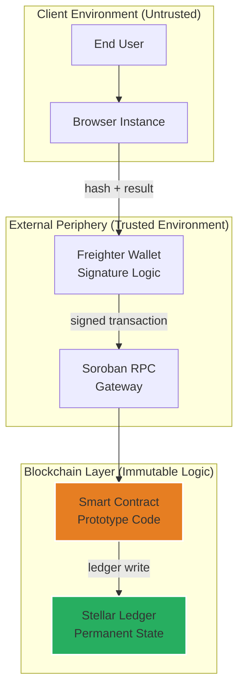

# Security Model: AuthentiScan Prototype

This document outlines the security architecture and trust assumptions for the AuthentiScan project. As an **experimental prototype**, it is designed to demonstrate concepts rather than provide production-grade security guarantees.

## Trust Architecture

## Abstract Security Properties

| Property | Implementation Method | Status |
|----------|----------|--------|
| **Content integrity** | SHA-256 Content Fingerprinting | ✅ Demonstrated |
| **Record immutability** | Stellar Ledger + Write-Once Logic | ✅ Demonstrated |
| **Submission Auth** | Freighter Wallet Integration | ✅ Enforced |
| **Duplicate Prevention** | Hash-Based Storage Keys | ✅ Enforced |
| **Data Privacy** | Local Hashing (Raw video not stored) | ✅ By Design |

## Key Disclosures

- **AI Analysis is Probabilistic**: Confidence scores from the prototype forensic module are estimates and current research results. They do not constitute absolute proof or legal truth.
- **Experimental Logic**: The smart contract and frontend code are prototypes and have not undergone a professional security audit.
- **Hash-Based, Not Semantic**: The system identifies exact byte sequences. Minor re-encoding by platforms will result in different hashes, even if the visual content is identical.
- **Testnet Deployment**: This is a laboratory project deployed on Stellar Testnet for demonstration and peer review.

## Known Limitations

| Constraint | Explanation | Impact |
|-----------|-----------|--------|
| **Re-encoding sensitivity** | Modern video platforms often transcode uploads, changing the byte sequence. | A visual duplicate may have a different hash than the original. |
| **Mock AI Indicators** | Some diagnostic metrics in the UI are currently simulated for demonstration. | Provides a vision of future capability rather than current forensic power. |
| **Environment Risks** | Browser-based hashing is subject to the security of the local machine. | Compromised endpoints could provide malicious input data. |

## Path to Production (Future Work)

- **Security Audits**: Professional review of smart contract Rust logic and frontend data handling.
- **Mainnet Migration**: Secure key management, rate limiting, and robust administrative protocols.
- **Decentralized AI Oracles**: Transitioning from local prototypes to decentralized forensic analysis providers.

---
*© 2026 AuthentiScan (Experimental Prototype by Tunahan Türker Ertürk)*
